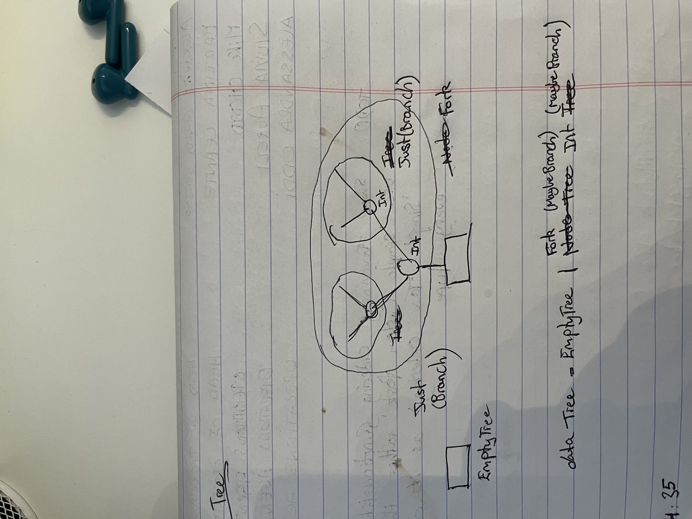

# Documentation: Haskell


## What is Haskell ?
> Haskell is a powerful and expressive functional programming language. Functional programming is a programming paradigm that focuses on writing code using pure functions.

## What is a pure fn ?
- A pure function is one where the input is always streamlined to the known output without interference or side effects. 

## Key concepts in Haskell ?

1. Strongly typed
2. Type inference
3. Immutable data - Data is unchangeable once created. Create new data based on existing data.
4. Algebraic data types - Data types that can be flexible, recursive and complex.

There are few ways these operator types can exist - essentially an Either or a Union, or complex combination

Either example (Red or Green or Blue): 

```hs

data Color = Red | Green | Blue

```


Product example (Double * Double): 

```hs

data Point = Point Double Double

```

Complex example: 

```hs
eg. 

# If we wanted to represent a Tree in Haskell: 

       5
     /   \
    3     8
   / \   / \
  2   4 7   9

# We would use: 

data Tree = Empty | Fork (Maybe Branch) Int (Maybe Branch)

# This covers all possibilities of a tree type

{- 

      \/    \/
      🟩   🟩
        \ / 
        🟫           
                    
    Full tree

                       4   6                   6
                        \ /          or     \ /
         🟫: Empty      🟩: Fork            🟩 :  Fork (Maybe Branch)

      Where,

        \ or / : Branch

        🟩 : Int 
 
-}


# Then to represent the exact tree above: 

Fork (Fork ( Fork Nothing 2 Nothing ) 3 (Fork Nothing 4 Nothing)) 5 (Fork (Fork Nothing 7 Nothing) 8 (Fork Nothing 9 Nothing))

```




> NOTE: A "Maybe" type is essentially an optional type in every other language. However, Maybe compiles to either - Nothing or Just ?, which is basically null or the value
> All these operator types are defined by placing "data" in front of them


# What is a monad?

- A monad is an overall wrapper function that provides order to all other functions to be executed in a sequence.

- They provide a containerized environment where each step or instruction is given a specific order and must happen in that order.

- The best way to think of a monad is it represents a bouncer in a nightclub who checks IDs and allows people to enter in a specific sequence, a monad in Haskell ensures that certain actions or operations take place in a specific order. 

    It keeps things organized and ensures that each step is executed properly.

- So, you can imagine monads as the bouncer that maintains the order of actions or instructions, making sure they happen in the right sequence. Each action is like a person in line waiting for their turn to enter or perform their task.

```hs

eg. 

main :: IO ()
main = do
  putStrLn "What's your name?"
  name <- getLine
  putStrLn ("Hello, " ++ name ++ "!")

```

As you can see, the monad is structured to allow 3 different kinds of actions to happen in a certain order. These actions are then executed as shown above.


### .Map()
1. Extract value from input Monad
2. Transform value in desired manner
3. Return transformed value

Effect: 
- Stay within the input monadic context (ie. Maybe => Maybe)

---

### .flatMap()
1. Extract value from input Monad
2. Transform value in desired manner
3. Return transformed value in another monadic context (ie. either same context but diff instance or different context)

Effect: 

- Move out of the input monadic context 
- Move into output monadic context

